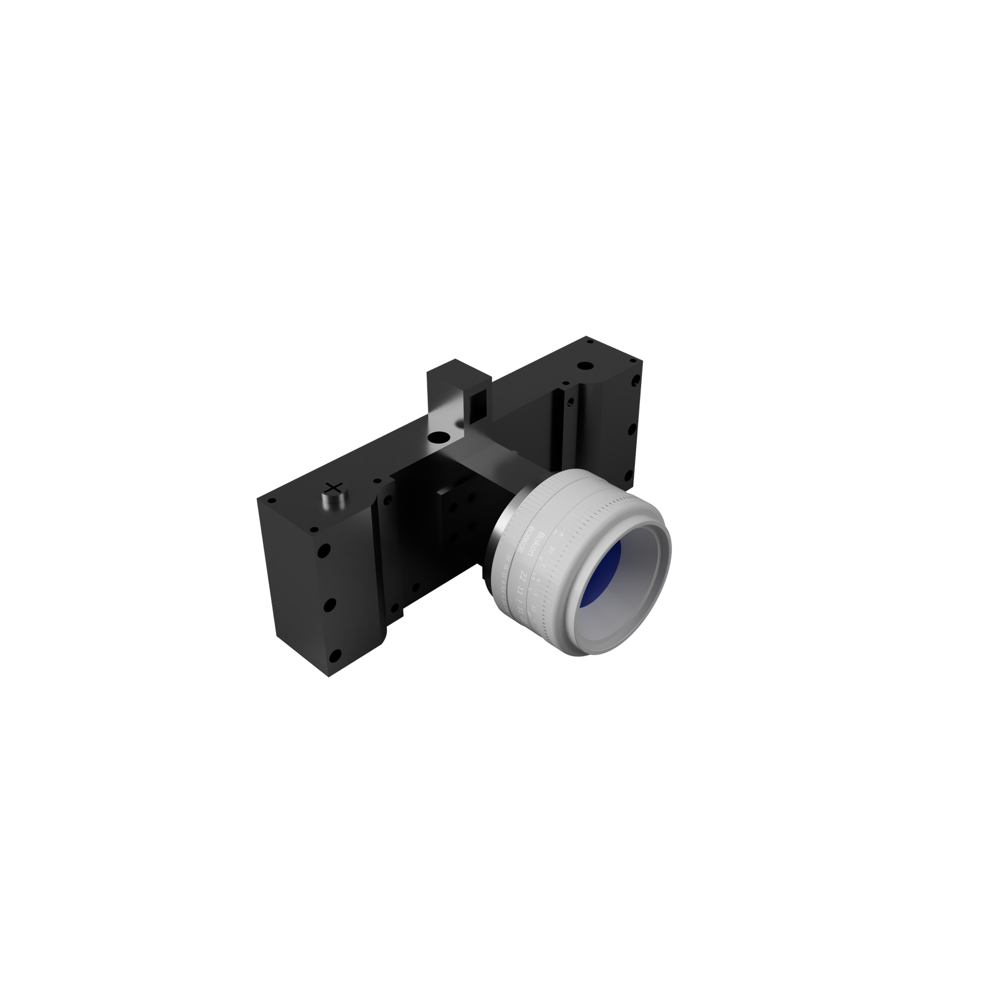
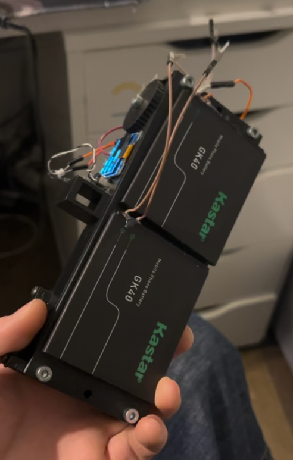
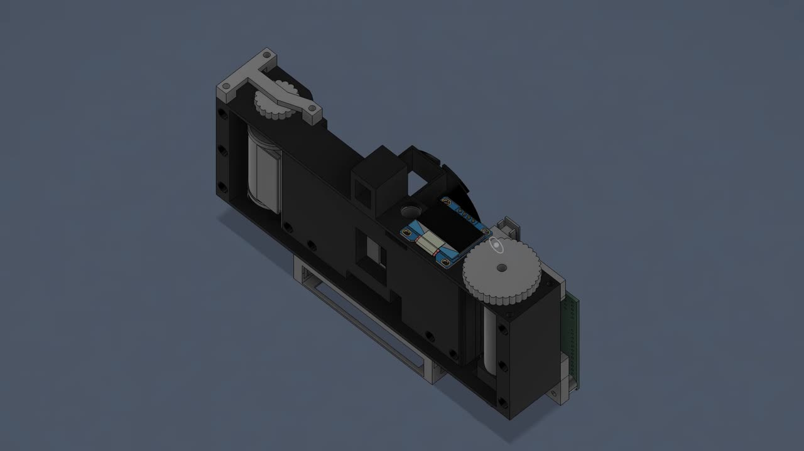
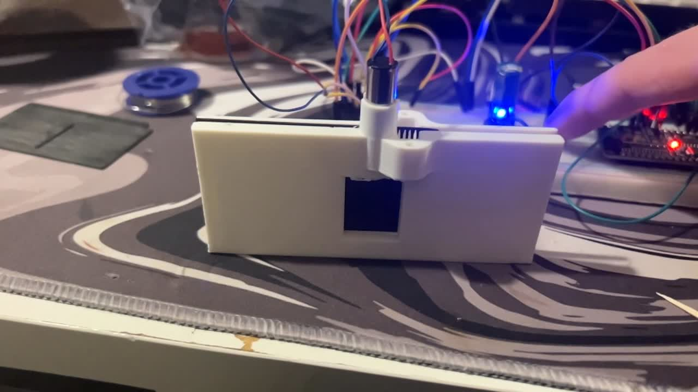
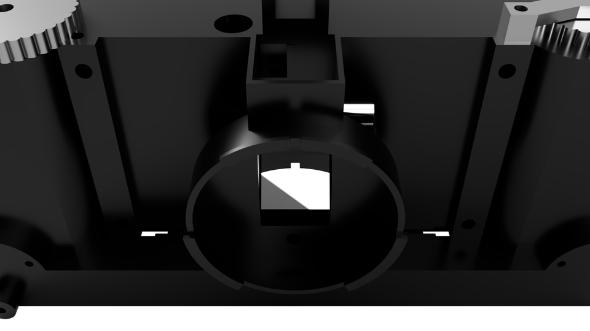
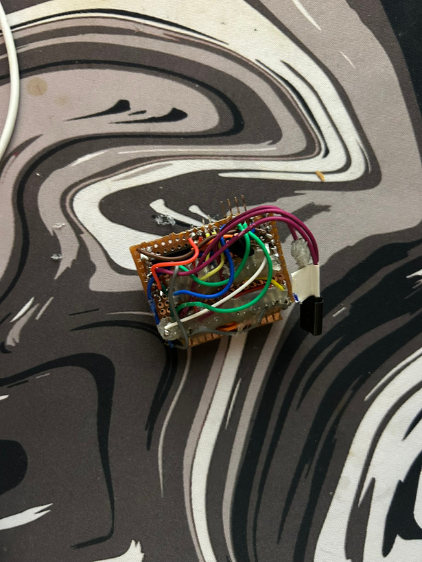
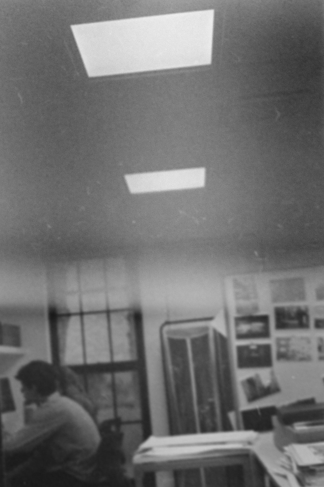
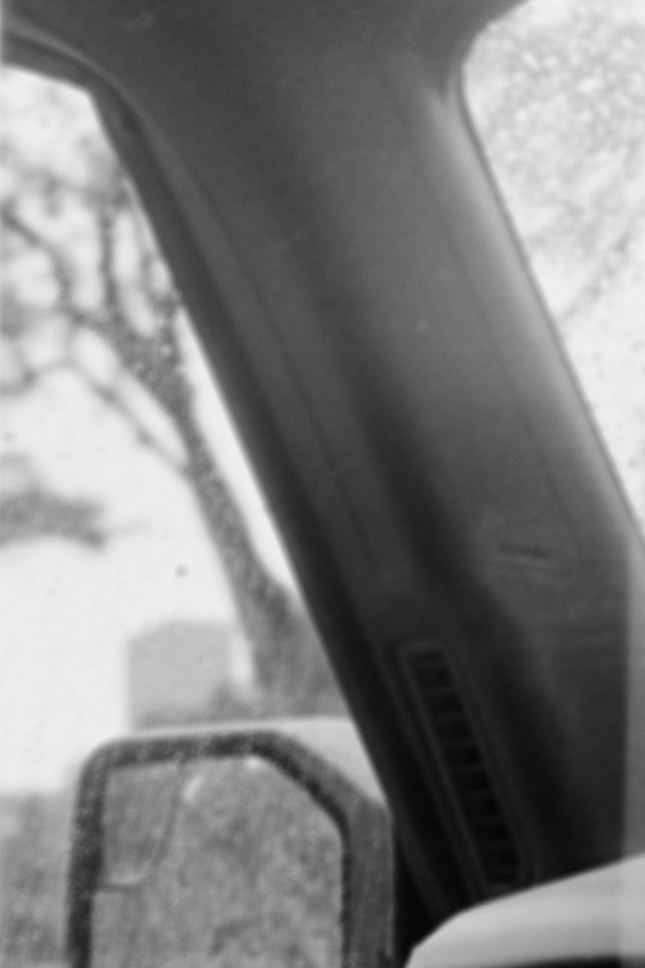

# OpenCamera

An open-source, mostly 3D-printed 35 mm SLR film-camera prototype controlled by an ESP32-C3.



OpenCamera combines a manual 35 mm film transport with three electronically controlled systems:

- a small servo raises and lowers the SLR mirror;
- an 8520 coreless DC motor drives a rack-and-pinion shutter;
- a slot-type infrared sensor measures the shutter sweep so the ESP32-C3 can calculate the effective exposure time.

This guide describes the current **V71 prototype** represented by the CAD assembly, capstone presentation, and firmware in this repository.

> [!IMPORTANT]
> OpenCamera is a working prototype, not yet a turnkey camera kit. The repository contains one STEP assembly and working controller firmware, but it does not yet include individual STL files, a circuit schematic, a finalized PCB, a fastener list, validated slicer settings, or a film-advance counter. Expect to separate the CAD assembly into printable parts, measure hardware, adjust fits, and calibrate your build.

## Project files

| File | Purpose |
| --- | --- |
| [`camera v71.step`](camera%20v71.step) | Complete V71 mechanical assembly, including the body, film canister and roller, manual winder, mirror assembly, Canon FD flange, and servo hardware |
| [`OpenCamera_Firmware/firmware.ino`](OpenCamera_Firmware/firmware.ino) | ESP32-C3 shutter, mirror, sensor, OLED, and button controller |
| [`Capstone Presentation.pptx`](Capstone%20Presentation.pptx) | Design history, prototype photos, subsystem descriptions, and test results |

## Before you build

The current design makes several deliberate simplifications:

- **Film advance is manual.** An earlier geared-stepper design was abandoned because its electronics were too difficult to debug within the project timeline.
- **Electronics are built on protoboard.** A custom PCB was explored, but the current direct-I/O firmware no longer needs the earlier stepper circuitry.
- **The shutter has no home or end-position switch.** The firmware assumes the shutter starts at the correct end and toggles its direction flag after every trigger—even one that times out.
- **Light sealing and focus require hand fitting.** Prototype testing identified light leaks and focal-flange distance as the two main mechanical challenges.
- **The lux sensor described in the presentation is not implemented in the current firmware.** Exposure is adjusted manually by changing motor PWM.

<p align="center">
  
</p>

## How one exposure works

1. Pressing the trigger pulls its ESP32 input to ground.
2. The mirror servo moves from `40°` (viewing position) to `75°` (exposure position), then waits 250 ms.
3. The TB6612FNG drives the shutter motor at the selected PWM value. The default is `185` on a `0–255` scale.
4. The controller waits for the IR sensor to change from HIGH to LOW, records `t1`, then waits for it to return HIGH and records `t2`.
5. The motor stops, the exposure time is calculated, and the result is shown on the OLED and printed over USB serial.
6. The mirror returns to `40°`. After the exposure routine exits, the firmware toggles the direction for the next trigger.

The mirror, shutter, and sensor must all work on the bench before film is loaded.

## Parts

### Mechanical and optical parts

| Part | Notes |
| --- | --- |
| Printed V71 camera parts | Export the required bodies from the STEP assembly. The presentation recommends opaque ABS because it is durable and light resistant. |
| 35 mm film canister and take-up roller | Both are represented in the CAD assembly. The current take-up/advance mechanism is manual. |
| Canon FD lens and compatible flange | The V71 assembly includes a component named `Bague_CanonFD`. Verify focus on your printed body before exposing film. |
| Shutter panel/carriage, rack, and pinion | The shutter is designed as a removable module that screws into the camera body. |
| Laser-cut acrylic mirror | Mounted to the mirror mechanism and moved by a mini servo. A first-surface mirror will avoid the double image produced by ordinary back-silvered mirror material. |
| Translucent laminate or focusing-screen material | Mounted above the mirror so the reflected image can be viewed. |
| Light-sealing material | Opaque foam, flocking, paint, tape, or another suitable material for closing seams after fitting. |
| Shafts, screws, and small hardware | Sizes are not documented separately; inspect and measure the holes in the STEP assembly before ordering. |

### Electronics

| Part | Role |
| --- | --- |
| ESP32-C3 development board | Runs the firmware. Use a board that exposes every GPIO listed in the wiring table below. |
| TB6612FNG dual H-bridge module | Controls shutter-motor speed and direction using channel A. |
| 8520 coreless DC motor | Drives the rack-and-pinion shutter. Match its rated voltage when choosing the motor supply. |
| Slot-type IR sensor | Produces the two timing edges used to measure the shutter sweep. |
| Small RC servo | Moves the mirror. The presentation/CAD uses a mini 2 g servo; the mount may need adaptation for another servo. |
| 128×64 SSD1306 I²C OLED | Optional status display at address `0x3C`; the camera can still report over serial if it is absent. |
| 3 normally-open momentary buttons | Trigger, speed up, and speed down. The firmware uses internal pull-ups. |
| Prototyping board and hookup wire | Matches the current prototype electronics approach. |
| Suitable regulated power supplies | Size the logic, motor, and servo supplies for the actual components. Join their grounds. Never power a motor or servo from a GPIO pin. |

The presentation also mentions a boost converter, but the repository does not document the final power circuit or supply voltages. Design the power system around the ratings of your chosen board, motor, servo, sensor, and display.

### Tools and software

- a CAD program that can open STEP assemblies and export individual bodies;
- a slicer and 3D printer;
- a laser cutter or another safe method of cutting the mirror;
- soldering tools, wire cutters, and a multimeter;
- calipers for checking the film path, shutter feature, and optical spacing;
- Arduino IDE or another Arduino-compatible ESP32 build environment;
- a sacrificial or already-developed strip of 35 mm film for transport testing.

## Build guide

### 1. Inspect and separate the CAD assembly

Open [`camera v71.step`](camera%20v71.step) in your CAD program and inspect the complete mechanism before exporting anything. The assembly contains named components for the camera body, test housing, film canister, winder, film-can roller, mirror assembly, light-tight insert, Canon FD flange, and mini servo hardware.

Export only printable camera components as individual STL or 3MF files. Do not export vendor models such as the servo as printable parts. Preserve the STEP file's millimetre scale and check at least one known part before slicing.

The design is modular: the shutter is a separate unit that mounts inside the body. Keep that interface intact so the shutter can be removed for adjustment.



### 2. Print and prepare the camera parts

The original build used ABS for opacity, durability, and longevity. If you use another material, hold a strong flashlight behind a test print in a dark room; a print that looks black in daylight may still leak light.

There are no validated print settings in the repository. Use the CAD geometry to choose orientation and supports, then dry-fit every moving part before final assembly. Clean the following areas carefully:

- the film rails and canister/roller pockets;
- the shutter-carriage guide and rack;
- the motor, servo, sensor, and lens-flange mounts;
- the removable shutter-module screw holes;
- the rear-cover seam and all openings into the film chamber.

Nothing in the film path should scratch emulsion, and the shutter must travel freely without binding.

### 3. Assemble the body and manual film path

1. Fit the 35 mm supply canister into its pocket.
2. Fit the take-up roller and manual winder at the opposite side.
3. Thread sacrificial film across the gate and onto the take-up roller.
4. Turn the winder slowly. Confirm that the film stays flat at the exposure gate and does not climb, buckle, or scrape.
5. Fit the rear panel and recheck the film plane. The prototype's rear panel was revised with a bulge to correct the film position and focal-flange distance.

Because the current design has no powered advance or frame counter, determine a repeatable manual advance distance with scrap film before shooting a real roll.

### 4. Build the shutter module

1. Mount the 8520 motor and pinion.
2. Install the shutter carriage so its rack meshes with the pinion without excessive pressure.
3. Move the carriage through its full stroke by hand. It must reach both ends without a tight spot.
4. Position the slot IR sensor so the shutter's timing feature passes fully through the sensor gap during each sweep.
5. Install the module in the body, but keep it accessible until calibration is complete.

The earliest shutter tests were performed as a separate bench assembly, which is the safest way to debug the motor and sensor before placing them inside a light-tight body.



> [!CAUTION]
> The firmware has a short, PWM-dependent jam timeout. Always test at low mechanical load, keep fingers clear of the rack and gears, and be ready to remove power. A stalled coreless motor can heat quickly.

### 5. Assemble the SLR mirror and viewfinder

The V71 viewfinder uses a laser-cut acrylic mirror on a mini servo. With the mirror down, light from the lens is reflected upward onto a translucent laminate focusing screen. Before an exposure, the servo raises the mirror out of the film path.



1. Attach the mirror securely to its carrier.
2. Center the servo mechanically before fitting the horn.
3. Install the servo and linkage without forcing either end of travel.
4. At the firmware's `40°` position, align the mirror so the lens image is centered on the focusing screen.
5. At `75°`, confirm that the mirror and linkage completely clear the exposure opening.
6. Adjust the horn position first; change `SERVO_DOWN` and `SERVO_UP` in firmware only for fine correction.

Servo angles are command values, not guaranteed physical angles. If the servo buzzes, stalls, or pushes against the body, disconnect it and correct the linkage or limits before continuing.

### 6. Wire the controller

The table below is taken from the actual constants in the current firmware. It replaces the older pin table that previously appeared in this README.

| ESP32-C3 GPIO | Connect to | Firmware name | Behavior |
| ---: | --- | --- | --- |
| `0` | TB6612FNG `STBY` | `STBY` | Driven HIGH to enable the motor driver |
| `1` | Mirror-servo signal | `SERVO_PIN` | 50 Hz servo control |
| `2` | TB6612FNG `PWMA` | `PWMA_PIN` | Shutter-motor PWM |
| `3` | TB6612FNG `AIN2` | `AIN2` | Motor direction |
| `4` | TB6612FNG `AIN1` | `AIN1` | Motor direction |
| `5` | Trigger button | `TRIGGER_BTN` | Active LOW; connect the other button terminal to GND |
| `6` | Speed-up button | `SPEED_UP_BTN` | Active LOW; connect the other button terminal to GND |
| `7` | Speed-down button | `SPEED_DOWN_BTN` | Active LOW; connect the other button terminal to GND |
| `8` | OLED `SDA` | — | I²C data |
| `9` | OLED `SCL` | — | I²C clock |
| `20` | IR-sensor digital output | `SENSOR_PIN` | Expected sequence during a sweep: HIGH → LOW → HIGH |

Also make these non-GPIO connections:

- connect TB6612FNG `AO1` and `AO2` to the shutter motor;
- connect TB6612FNG logic power to a compatible logic rail and `VM` to a supply appropriate for the motor;
- power the servo from a regulated supply that can handle its moving and stall current;
- power the OLED and IR module at voltages supported by their exact boards;
- connect the grounds of the ESP32-C3, motor driver, sensor, OLED, servo supply, and motor supply together.

Do not copy the layout of the prototype board blindly; use the pin table and verify every wire with a multimeter.



### 7. Install and upload the firmware

Install an ESP32 board package in your Arduino-compatible environment, then install these libraries:

- **Adafruit SSD1306**
- **Adafruit GFX Library**
- **ESP32Servo**

Open [`OpenCamera_Firmware/firmware.ino`](OpenCamera_Firmware/firmware.ino), select the board definition that matches your ESP32-C3, and upload the sketch. Open the serial monitor at **115200 baud**.

On a normal start you should see messages for the OLED, servo, direct pin configuration, and `SYS_STATE: IDLE`. If no OLED is detected, the controller deliberately continues using serial output.

### 8. Perform a no-load electronics test

Disconnect the motor from the shutter rack for the first test.

1. Power the system and confirm that the mirror moves to its down position without binding.
2. Press speed up and speed down. The displayed PWM should change in steps of 5.
3. Confirm the sensor reads HIGH when clear, LOW when interrupted, and HIGH when clear again. If your module has inverted logic, the stock firmware will time out and must be adapted.
4. Tap the trigger while observing the motor direction. The next successful trigger should reverse it.
5. If the first direction would drive an installed shutter into the wrong end, swap the motor leads or correct the direction logic before coupling the rack.

The firmware does not know the shutter's absolute position. After a reset or interrupted sweep, manually return the shutter to the expected starting end and verify the commanded direction before firing again. A timed-out trigger still toggles the direction flag.

### 9. Test the complete mechanism

Couple the motor to the rack and start with the shutter module outside the camera if possible.

1. Set the carriage at the correct starting end.
2. Use a conservative PWM and fire once.
3. Confirm a clean HIGH → LOW → HIGH sensor transition.
4. Confirm the motor stops without hitting a hard end.
5. Fire again and verify that the carriage returns in the opposite direction.
6. Repeat until the movement is reliable, then install the module in the body and repeat the test.

The timeout scales from 200 ms at PWM 0 to 25 ms at PWM 255. At the default PWM of 185 it is roughly 74 ms. A mechanism that is too slow, sticky, misaligned, or not seen by the sensor will shut down before completing the cycle.

### 10. Calibrate the shutter measurement

The firmware uses two physical values:

```cpp
const float GATE_DISTANCE = 16.0; // mm represented by the measured sensor interval
const float SLIT_WIDTH    = 2.0;  // mm of the shutter opening
```

Measure both values on your finished shutter rather than assuming the defaults match your print. The firmware calculates:

```text
measured_seconds = (t2 - t1) / 1,000,000
velocity_mm_s    = GATE_DISTANCE / measured_seconds
exposure_ms      = (SLIT_WIDTH / velocity_mm_s) × 1,000
```

The serial monitor reports the result as `SHUTTER:<milliseconds>` and also prints calculated velocity and sensor-pulse duration. Compare that value with an independent shutter tester or high-frame-rate video, adjust the dimensions/PWM as needed, and repeat across several cycles. Consistency matters as much as the average value.

### 11. Set focus and make the body light-tight

Do these checks with no unprocessed film in the camera:

1. Mount the intended Canon FD lens.
2. Place translucent material temporarily at the film plane and aim at a distant, high-contrast target.
3. Adjust the lens/flange/film-plane relationship until the image focuses at both the film plane and the viewfinder screen.
4. In a dark room, put a bright light inside the empty body and inspect every seam from outside; then reverse the test by lighting the outside and inspecting the film chamber.
5. Seal the rear panel, lens-flange interface, shutter-module joint, viewfinder opening, fastener holes, and wire exits without obstructing moving parts.

Do not load fresh film until the shutter, focus, film path, and light sealing all pass independently.

### 12. Load film and shoot

1. In subdued light, load the 35 mm canister and attach the leader to the take-up roller.
2. Advance manually and verify that the film perforations and emulsion remain undamaged.
3. Close and seal the rear panel.
4. Use the speed buttons to select a calibrated motor PWM.
5. Frame and focus on the SLR screen.
6. Press the trigger once and wait for the display to return to `IDLE`.
7. Read the measured exposure time from the OLED or serial output.
8. Manually advance one frame before the next exposure.

The current firmware alternates shutter direction after each trigger; it does not advance the film automatically.

## What the controls and messages mean

| Display or serial message | Meaning |
| --- | --- |
| `PWM: 185` | Current shutter-motor command on a 0–255 scale |
| `FWD` / `REV` | Direction flag at the time of the most recent OLED refresh; after a shot it may show the completed sweep until the display updates again |
| `MIRROR UP` | Mirror is moving out of the optical path |
| `RUNNING` | Shutter motor is active |
| `SHUTTER:8.4500` | Calculated exposure time in milliseconds |
| `MIRROR DN` | Mirror is returning to the viewing position |
| `IDLE` | Exposure cycle is complete |
| `T-OUT 1` | The first expected IR transition never arrived |
| `STUCK 1` | The sensor went LOW but did not return HIGH before the timeout |

## Troubleshooting

| Problem | Check first |
| --- | --- |
| OLED is blank | Confirm address `0x3C`, SDA on GPIO 8, SCL on GPIO 9, power, and ground. Serial output should still work. |
| `T-OUT 1` | Sensor idle level, sensor alignment, shutter starting position, motor direction, rack binding, and motor power |
| `STUCK 1` | Shutter blocking the slot, sensor gap/alignment, insufficient travel, rack binding, or inverted sensor logic |
| ESP32 resets when firing | Motor/servo supply sag, inadequate regulation, missing common ground, or electrical noise |
| Motor hits an end stop | Wrong starting end or direction; there are no homing switches |
| Mirror buzzes or does not clear the gate | Servo horn alignment, linkage interference, and `SERVO_DOWN`/`SERVO_UP` limits |
| Viewfinder and film plane focus differently | Mirror angle, focusing-screen height, rear-panel/film position, and lens flange spacing |
| Fogged or streaked film | Rear-cover seam, flange, shutter-module joint, viewfinder, wire exits, or translucent print walls |
| Exposure varies from shot to shot | Sensor alignment, motor voltage, gear mesh, carriage friction, PWM, and measured calibration dimensions |

## Prototype results

The presentation documents repeated body, focus, and light-tightness revisions. The two images below are viewfinder/optical tests from the V71 stage; they are useful as evidence that the mirror path works, not as a claim that the camera is fully production-ready.

| Viewfinder test 1 | Viewfinder test 2 |
| --- | --- |
|  |  |

## Known next steps

The capstone presentation identifies these remaining development goals:

- redesign the PCB for easier assembly;
- finish the external housing;
- improve light-tightness;
- add accurate, repeatable film advance.

Homing or end-position sensing would also make the bidirectional shutter safer and easier to recover after a reset.

## Contributing

Contributions are welcome, especially individual printable exports, an accurate bill of materials, a verified schematic, PCB work, light-sealing improvements, lens-mount validation, shutter calibration data, and a repeatable film-advance mechanism.

When submitting a mechanical change, state the CAD revision, print material, slicer settings, measured fit, lens mount, and test result. When submitting an electrical change, update both the firmware constants and this wiring table.

## License and image source

The repository is licensed under the [GNU General Public License v3.0](LICENSE).

Project photos and CAD renders in `docs/images/` were extracted from [`Capstone Presentation.pptx`](Capstone%20Presentation.pptx), presented by Alexander Basham at PPCDS in 2026. The original presentation remains unchanged.
